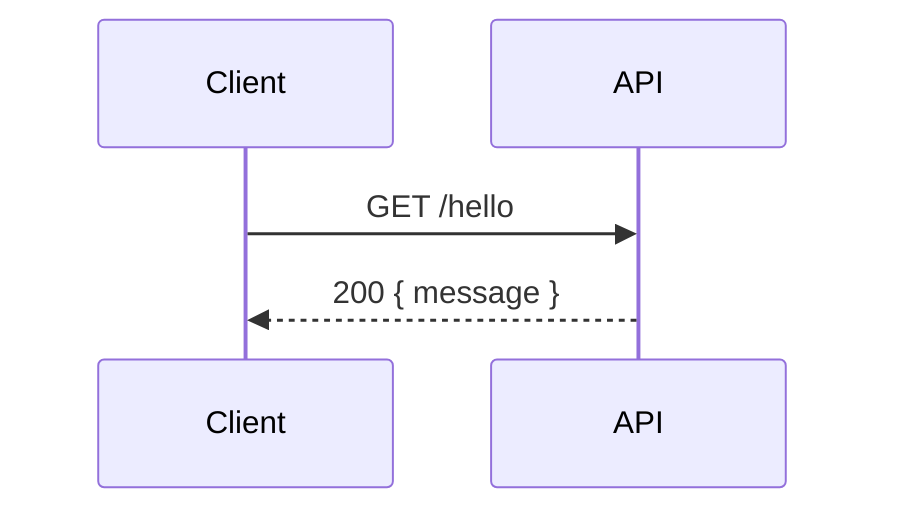
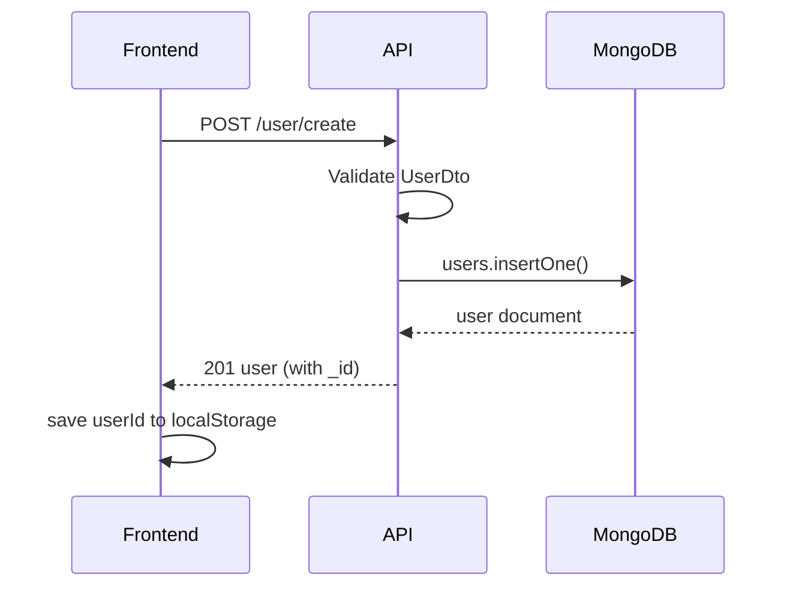
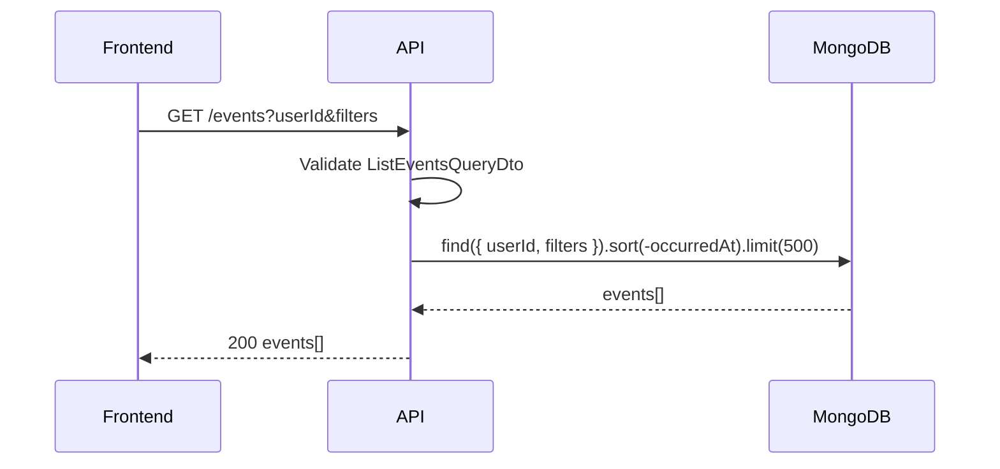
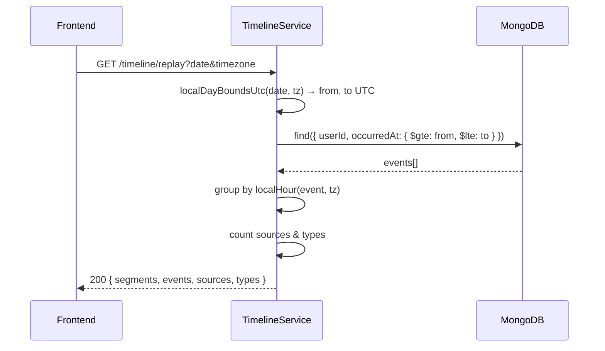
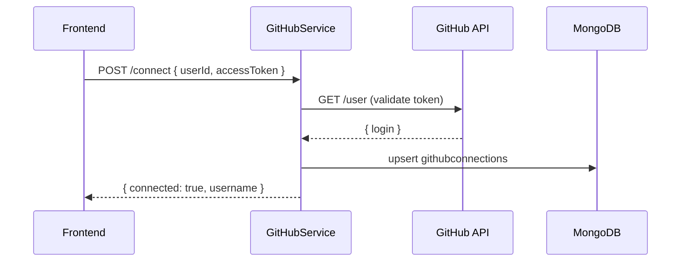
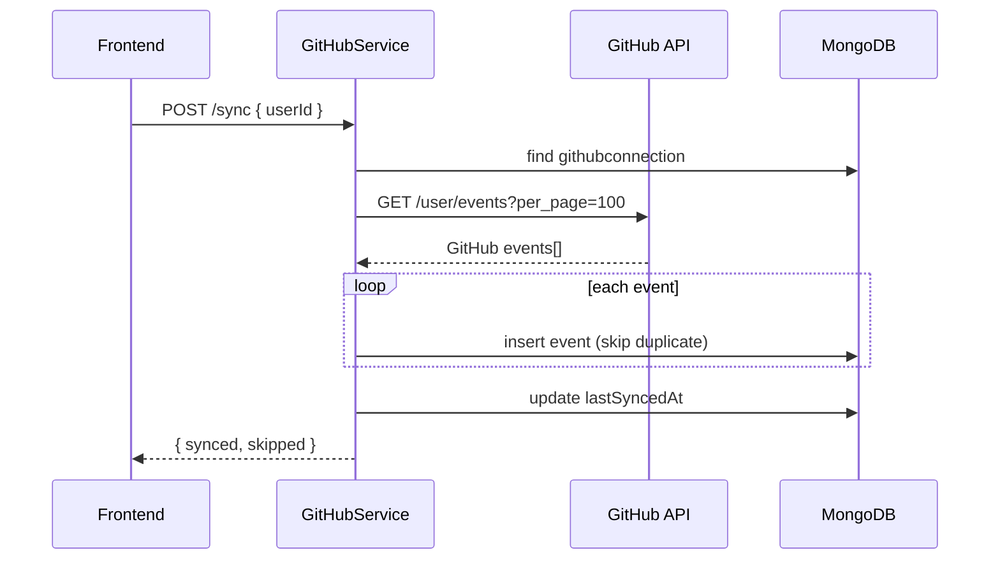

# AI Time Machine — Phase 4 API Documentation

**Status:** v1.0  
**Date:** 2026-07-20  
**Base URL:** `http://localhost:3000` (dev) — see `PORT` in backend `.env`  
**Content-Type:** `application/json` (all POST bodies)  
**Auth (v1):** None — pass `userId` explicitly. JWT planned v1.1.

---

## Table of Contents

1. [Conventions](#1-conventions)
2. [Health](#2-health)
3. [Users](#3-users)
4. [Events](#4-events)
5. [Timeline](#5-timeline)
6. [GitHub Connector](#6-github-connector)
7. [Error Reference](#7-error-reference)
8. [Rate Limits (Planned)](#8-rate-limits-planned)
9. [Full API Client](#9-full-api-client)

---

## 1. Conventions

### 1.1 Base URL

```env
# Frontend
VITE_API_URL=http://localhost:3000
```

### 1.2 CORS

Backend allows origins in `CORS_ORIGINS` (comma-separated).  
Default includes `http://localhost:5173`.

### 1.3 Dates & timezones

| Field | Format | Example |
|---|---|---|
| `occurredAt` | ISO 8601 UTC | `2026-07-20T09:15:00.000Z` |
| `date` (timeline) | `YYYY-MM-DD` local calendar | `2026-07-20` |
| `timezone` | IANA | `Asia/Kolkata` |

### 1.4 Validation errors

All `400` responses follow NestJS format:

```json
{
  "statusCode": 400,
  "message": ["userId should not be empty", "timezone must be a string"],
  "error": "Bad Request"
}
```

### 1.5 Endpoint summary

| Method | Path | Auth | Purpose |
|---|---|---|---|
| GET | `/hello` | — | Health check |
| POST | `/user/create` | — | Create account |
| POST | `/events` | userId in body | Ingest one event |
| POST | `/events/batch` | userId in body | Ingest many events |
| GET | `/events` | userId in query | List events |
| GET | `/timeline/day` | userId in query | Events for one day |
| GET | `/timeline/range` | userId in query | Events in range |
| GET | `/timeline/replay` | userId in query | Day replay with segments |
| POST | `/connectors/github/connect` | userId in body | Connect GitHub PAT |
| POST | `/connectors/github/sync` | userId in body | Sync GitHub activity |
| GET | `/connectors/github/status` | userId in query | Connection status |

---

## 2. Health

### `GET /hello`

**Purpose:** Verify API is running.

**Authentication:** None

**Request:** No body, no query params.

**Response `200`:**

```json
{
  "message": "Hello World!"
}
```

**Example:**

```bash
curl http://localhost:3000/hello
```

**Flow:**



---

## 3. Users

### `POST /user/create`

**Purpose:** Create a new user account. Returns MongoDB `_id` as `userId` for all subsequent calls.

**Authentication:** None (v1)

**Request body:**

| Field | Type | Required | Validation |
|---|---|---|---|
| `name` | string | yes | non-empty string |
| `email` | string | yes | valid email |
| `password` | string | yes | non-empty string |

```json
{
  "name": "Aakash Sharma",
  "email": "aakash@example.com",
  "password": "secret123"
}
```

**Response `201`:**

```json
{
  "_id": "674a1b2c3d4e5f6789012345",
  "name": "Aakash Sharma",
  "email": "aakash@example.com",
  "password": "secret123",
  "createdAt": "2026-07-20T08:00:00.000Z",
  "updatedAt": "2026-07-20T08:00:00.000Z"
}
```

**Validation errors `400`:**

| Condition | Message |
|---|---|
| Missing name | `name must be a string` |
| Invalid email | `email must be an email` |
| Missing password | `password must be a string` |
| Extra fields | `property X should not exist` (forbidNonWhitelisted) |

**Rate limit (planned):** 10 req/min per IP

**Example — curl:**

```bash
curl -X POST http://localhost:3000/user/create \
  -H "Content-Type: application/json" \
  -d '{"name":"Aakash","email":"aakash@example.com","password":"secret123"}'
```

**Example — fetch:**

```ts
const user = await fetch('http://localhost:3000/user/create', {
  method: 'POST',
  headers: { 'Content-Type': 'application/json' },
  body: JSON.stringify({ name: 'Aakash', email: 'aakash@example.com', password: 'secret123' }),
}).then((r) => r.json());

localStorage.setItem('atm_userId', user._id);
```

**Sequence:**



---

## 4. Events

### `POST /events`

**Purpose:** Ingest a single normalized digital activity event.

**Authentication:** `userId` in body (v1)

**Request body:**

| Field | Type | Required | Notes |
|---|---|---|---|
| `userId` | string | yes | MongoDB user `_id` |
| `source` | enum | yes | See [sources](#event-sources) |
| `type` | enum | yes | See [types](#event-types) |
| `title` | string | yes | Headline |
| `occurredAt` | ISO date | yes | UTC timestamp |
| `content` | string | no | Body text |
| `summary` | string | no | AI summary (future) |
| `projectId` | string | no | e.g. `owner/repo` |
| `tags` | string[] | no | Labels |
| `sourceEventId` | string | no | Dedupe key |
| `metadata` | object | no | Raw connector data |

**Event sources:** `gmail` `slack` `github` `vscode` `chrome` `calendar` `notion` `drive` `photos` `manual`

**Event types:** `email` `message` `commit` `file_edit` `browse` `meeting` `note` `file` `photo` `other`

**Request example:**

```json
{
  "userId": "674a1b2c3d4e5f6789012345",
  "source": "manual",
  "type": "note",
  "title": "Decided to use IANA timezones",
  "content": "Store UTC, display local. Use luxon on backend.",
  "occurredAt": "2026-07-20T10:30:00.000Z",
  "projectId": "ai-time-machine",
  "tags": ["architecture", "timezone"],
  "sourceEventId": "manual-note-001"
}
```

**Response `201`:** Full event document with `_id`, `createdAt`, `updatedAt`.

**Duplicate `sourceEventId`:** MongoDB unique index returns error (not yet mapped to 409 — returns 500 today; fix planned).

**Example — curl:**

```bash
curl -X POST http://localhost:3000/events \
  -H "Content-Type: application/json" \
  -d '{
    "userId": "674a1b2c3d4e5f6789012345",
    "source": "manual",
    "type": "note",
    "title": "Test event",
    "occurredAt": "2026-07-20T10:30:00.000Z"
  }'
```

---

### `POST /events/batch`

**Purpose:** Ingest multiple events in one request.

**Request body:**

```json
{
  "events": [
    {
      "userId": "674a1b2c3d4e5f6789012345",
      "source": "github",
      "type": "commit",
      "title": "Push to owner/repo",
      "occurredAt": "2026-07-20T09:00:00.000Z",
      "sourceEventId": "github-111"
    },
    {
      "userId": "674a1b2c3d4e5f6789012345",
      "source": "github",
      "type": "message",
      "title": "PR #42: Add replay",
      "occurredAt": "2026-07-20T09:30:00.000Z",
      "sourceEventId": "github-222"
    }
  ]
}
```

**Response `201`:** Array of created event documents.

**Note:** Uses `insertMany` with `ordered: false` — partial success possible on duplicates.

---

### `GET /events`

**Purpose:** List and filter events for a user.

**Authentication:** `userId` in query (v1)

**Query parameters:**

| Param | Required | Type | Description |
|---|---|---|---|
| `userId` | yes | string | Owner |
| `from` | no | ISO date | Start filter on `occurredAt` |
| `to` | no | ISO date | End filter on `occurredAt` |
| `source` | no | enum | Filter by source |
| `projectId` | no | string | Filter by project |

**Response `200`:** Array of events (max **500**, sorted `occurredAt` descending).

**Example:**

```bash
curl "http://localhost:3000/events?userId=674a1b2c3d4e5f6789012345&source=github&from=2026-07-01&to=2026-07-31"
```

**Sequence:**



---

## 5. Timeline

### `GET /timeline/day`

**Purpose:** All events for one **local calendar day**.

**Query parameters:**

| Param | Required | Type | Description |
|---|---|---|---|
| `userId` | yes | string | Owner |
| `date` | yes | `YYYY-MM-DD` | Local calendar date |
| `timezone` | yes | IANA | e.g. `Asia/Kolkata` |

**Response `200`:**

```json
{
  "userId": "674a1b2c3d4e5f6789012345",
  "date": "2026-07-20",
  "timezone": "Asia/Kolkata",
  "totalEvents": 5,
  "events": []
}
```

**Invalid timezone `400`:**

```json
{
  "statusCode": 400,
  "message": "Invalid timezone \"Foo/Bar\". Use IANA format (e.g. Asia/Kolkata)."
}
```

**Example:**

```bash
curl "http://localhost:3000/timeline/day?userId=674a1b2c3d4e5f6789012345&date=2026-07-20&timezone=Asia/Kolkata"
```

---

### `GET /timeline/range`

**Purpose:** Events between two UTC timestamps (no timezone conversion).

**Query parameters:**

| Param | Required | Type |
|---|---|---|
| `userId` | yes | string |
| `from` | yes | ISO 8601 |
| `to` | yes | ISO 8601 |

**Response `200`:**

```json
{
  "userId": "674a1b2c3d4e5f6789012345",
  "from": "2026-07-01T00:00:00.000Z",
  "to": "2026-07-31T23:59:59.999Z",
  "totalEvents": 48,
  "events": []
}
```

---

### `GET /timeline/replay` ⭐ Main UI endpoint

**Purpose:** Day replay with hourly segments, source/type counts, and full event list.

**Query parameters:**

| Param | Required | Type | Description |
|---|---|---|---|
| `userId` | yes | string | Owner |
| `date` | yes | `YYYY-MM-DD` | Local calendar date |
| `timezone` | yes | IANA | User timezone |
| `projectId` | no | string | Filter to one project/repo |

**Response `200`:**

```json
{
  "userId": "674a1b2c3d4e5f6789012345",
  "date": "2026-07-20",
  "timezone": "Asia/Kolkata",
  "totalEvents": 12,
  "sources": {
    "github": 10,
    "manual": 2
  },
  "types": {
    "commit": 8,
    "message": 2,
    "note": 2
  },
  "segments": [
    {
      "hour": 9,
      "label": "09:00",
      "events": []
    },
    {
      "hour": 14,
      "label": "14:00",
      "events": []
    }
  ],
  "events": []
}
```

**Segment rules:**
- `hour` is 0–23 in **user's local timezone**
- `label` is `"HH:00"` (no UTC suffix)
- Segments only appear for hours that have events

**Example:**

```bash
curl "http://localhost:3000/timeline/replay?userId=674a1b2c3d4e5f6789012345&date=2026-07-20&timezone=Asia/Kolkata&projectId=owner/repo"
```

**Sequence:**



**Frontend code:**

```ts
const tz = Intl.DateTimeFormat().resolvedOptions().timeZone;
const replay = await fetch(
  `${API_URL}/timeline/replay?userId=${userId}&date=2026-07-20&timezone=${tz}`,
).then((r) => r.json());
```

---

## 6. GitHub Connector

### `POST /connectors/github/connect`

**Purpose:** Validate GitHub PAT and store connection for user.

**Request body:**

| Field | Type | Required |
|---|---|---|
| `userId` | string | yes |
| `accessToken` | string | yes |

```json
{
  "userId": "674a1b2c3d4e5f6789012345",
  "accessToken": "ghp_xxxxxxxxxxxxxxxxxxxx"
}
```

**Response `200`:**

```json
{
  "connected": true,
  "username": "aakashsharma"
}
```

**Errors:**

| Status | Condition |
|---|---|
| `400` | Invalid/expired PAT |
| `400` | Validation failure |

**PAT creation:** https://github.com/settings/tokens — scope: `repo` or `public_repo`

**Security:** Token stored in MongoDB plaintext today. Encrypt before production.

**Sequence:**



---

### `POST /connectors/github/sync`

**Purpose:** Fetch last 100 GitHub events and ingest as normalized events.

**Request body:**

```json
{
  "userId": "674a1b2c3d4e5f6789012345"
}
```

**Response `200`:**

```json
{
  "synced": 42,
  "skipped": 8
}
```

| Field | Meaning |
|---|---|
| `synced` | New events inserted |
| `skipped` | Duplicates (same `sourceEventId`) |

**Errors:**

| Status | Condition |
|---|---|
| `404` | GitHub not connected |
| `400` | GitHub API error |

**GitHub event mapping:**

| GitHub type | Our type | Title pattern |
|---|---|---|
| `PushEvent` | `commit` | `Push to {repo}` |
| `PullRequestEvent` | `message` | `PR #{n}: {title}` |
| `IssuesEvent` | `note` | `Issue #{n}: {title}` |
| `CreateEvent` | `other` | `Created {ref_type} in {repo}` |
| `WatchEvent` | `other` | `Starred {repo}` |
| `ForkEvent` | `other` | `Forked {repo}` |
| other | `other` | `{type} on {repo}` |

**Sequence:**



---

### `GET /connectors/github/status`

**Purpose:** Check if user has connected GitHub.

**Query:** `userId` (required)

**Response `200` — connected:**

```json
{
  "connected": true,
  "username": "aakashsharma",
  "lastSyncedAt": "2026-07-20T10:00:00.000Z"
}
```

**Response `200` — not connected:**

```json
{
  "connected": false
}
```

**Example:**

```bash
curl "http://localhost:3000/connectors/github/status?userId=674a1b2c3d4e5f6789012345"
```

---

## 7. Error Reference

| HTTP | When | Example message |
|---|---|---|
| `400` | Validation failed | `["timezone should not be empty"]` |
| `400` | Invalid timezone | `Invalid timezone "X". Use IANA format` |
| `400` | Invalid GitHub token | `Invalid GitHub token...` |
| `404` | GitHub not connected | `GitHub not connected. POST /connectors/github/connect first.` |
| `500` | Unhandled / DB error | `Internal server error` |

**Frontend error handler:**

```ts
async function request<T>(path: string, options?: RequestInit): Promise<T> {
  const res = await fetch(`${API_URL}${path}`, {
    headers: { 'Content-Type': 'application/json', ...options?.headers },
    ...options,
  });
  const body = await res.json().catch(() => ({}));
  if (!res.ok) {
    const msg = Array.isArray(body.message)
      ? body.message.join(', ')
      : body.message ?? `HTTP ${res.status}`;
    throw new Error(msg);
  }
  return body;
}
```

---

## 8. Rate Limits (Planned)

Not enforced in v1. Planned limits:

| Endpoint | Free | Pro |
|---|---|---|
| `POST /user/create` | 10/min/IP | — |
| `GET /timeline/replay` | 60/min/user | 300/min |
| `POST /connectors/github/sync` | 5/min/user | 20/min |
| `POST /events` | 100/min/user | 500/min |

---

## 9. Full API Client

Copy into frontend `src/lib/api.ts`:

```ts
const API_URL = import.meta.env.VITE_API_URL ?? 'http://localhost:3000';

function getTimezone(): string {
  return Intl.DateTimeFormat().resolvedOptions().timeZone;
}

function qs(params: Record<string, string | undefined>): string {
  const q = new URLSearchParams();
  for (const [k, v] of Object.entries(params)) {
    if (v != null && v !== '') q.set(k, v);
  }
  return q.toString();
}

async function request<T>(path: string, options?: RequestInit): Promise<T> {
  const res = await fetch(`${API_URL}${path}`, {
    headers: { 'Content-Type': 'application/json', ...options?.headers },
    ...options,
  });
  const body = await res.json().catch(() => ({}));
  if (!res.ok) {
    const msg = Array.isArray(body.message)
      ? body.message.join(', ')
      : body.message ?? `HTTP ${res.status}`;
    throw new Error(msg);
  }
  return body;
}

export const api = {
  health: () => request<{ message: string }>('/hello'),

  createUser: (data: { name: string; email: string; password: string }) =>
    request('/user/create', { method: 'POST', body: JSON.stringify(data) }),

  createEvent: (data: CreateEventPayload) =>
    request('/events', { method: 'POST', body: JSON.stringify(data) }),

  listEvents: (params: ListEventsParams) =>
    request(`/events?${qs(params)}`),

  replayDay: (userId: string, date: string, projectId?: string) =>
    request(`/timeline/replay?${qs({ userId, date, timezone: getTimezone(), projectId })}`),

  getTimelineDay: (userId: string, date: string) =>
    request(`/timeline/day?${qs({ userId, date, timezone: getTimezone() })}`),

  getTimelineRange: (userId: string, from: string, to: string) =>
    request(`/timeline/range?${qs({ userId, from, to })}`),

  connectGitHub: (userId: string, accessToken: string) =>
    request('/connectors/github/connect', {
      method: 'POST',
      body: JSON.stringify({ userId, accessToken }),
    }),

  syncGitHub: (userId: string) =>
    request('/connectors/github/sync', {
      method: 'POST',
      body: JSON.stringify({ userId }),
    }),

  getGitHubStatus: (userId: string) =>
    request(`/connectors/github/status?userId=${userId}`),
};
```

---

## Appendix — End-to-end developer flow

```bash
# 1. Health
curl http://localhost:3000/hello

# 2. Signup
USER=$(curl -s -X POST http://localhost:3000/user/create \
  -H "Content-Type: application/json" \
  -d '{"name":"Dev","email":"dev@test.com","password":"pass"}')
USER_ID=$(echo $USER | jq -r '._id')

# 3. Connect GitHub
curl -X POST http://localhost:3000/connectors/github/connect \
  -H "Content-Type: application/json" \
  -d "{\"userId\":\"$USER_ID\",\"accessToken\":\"ghp_YOUR_TOKEN\"}"

# 4. Sync
curl -X POST http://localhost:3000/connectors/github/sync \
  -H "Content-Type: application/json" \
  -d "{\"userId\":\"$USER_ID\"}"

# 5. Replay today
curl "http://localhost:3000/timeline/replay?userId=$USER_ID&date=2026-07-20&timezone=Asia/Kolkata"
```
