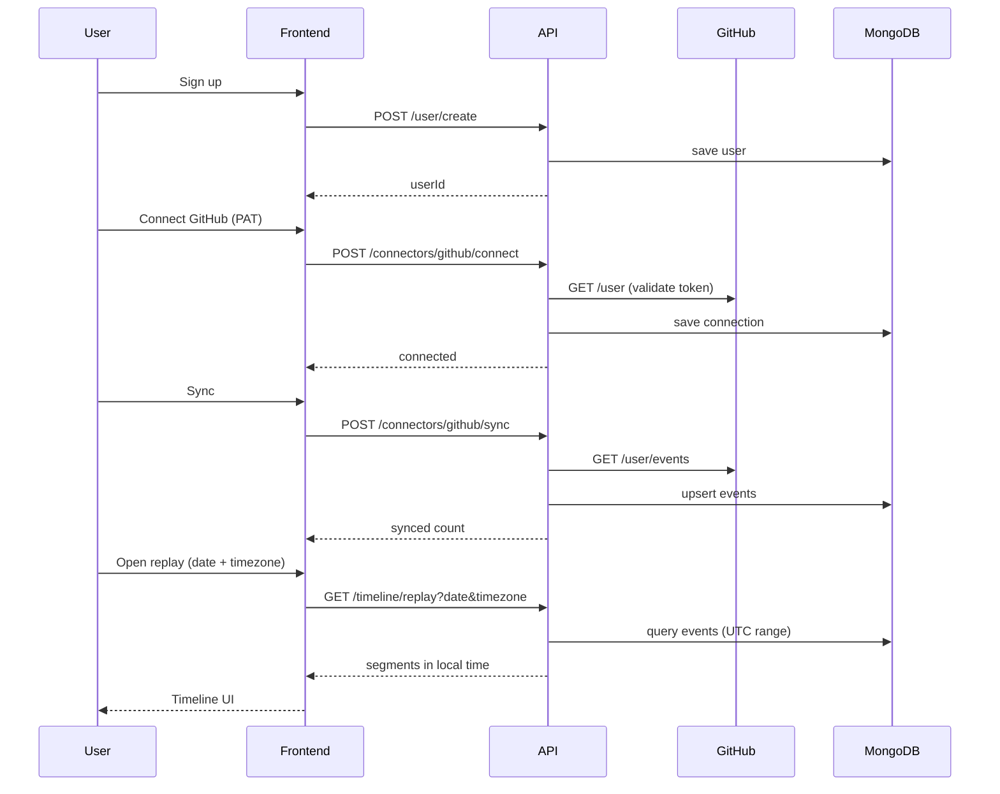

# AI Time Machine — Phase 2 Technical Design (HLD & LLD)

**Status:** Draft v0.1  
**Date:** 2026-07-20  
**Depends on:** `docs/product/phase-1-startup-bible.md` (v1 decisions locked)

---

## 1) Purpose

Define **how** we build AI Time Machine v1 for developers: services, data flows, storage, connectors, and the path from ingestion → timeline → replay → AI.

---

## 2) v1 Constraints (from Phase 1)

| Decision | Choice |
|---|---|
| Primary user | Developers |
| Privacy | Hybrid local-first; user controls cloud sync |
| First connector | GitHub |
| Time storage | UTC in DB |
| Time display | IANA timezone (`Asia/Kolkata`) → local day/hour |
| Auth (v1) | `userId` passed explicitly; JWT in Phase 2.1 |
| Primary DB (now) | MongoDB |
| AI / vectors / graph | Phase 2.2+ (designed, not built in v1 MVP) |

---

## 3) High-Level Architecture

```text
                    ┌─────────────────┐
                    │  Web / Desktop  │
                    │    Frontend     │
                    └────────┬────────┘
                             │ HTTPS
                             ▼
                    ┌─────────────────┐
                    │   NestJS API    │
                    │  (this repo)    │
                    └────────┬────────┘
          ┌──────────────────┼──────────────────┐
          ▼                  ▼                  ▼
   ┌─────────────┐   ┌─────────────┐   ┌─────────────┐
   │   Events    │   │  Timeline   │   │  Connectors │
   │   Module    │   │   Module    │   │  (GitHub)   │
   └──────┬──────┘   └──────┬──────┘   └──────┬──────┘
          │                  │                  │
          └──────────────────┼──────────────────┘
                             ▼
                    ┌─────────────────┐
                    │    MongoDB      │
                    │  users, events  │
                    │  github_conns   │
                    └─────────────────┘

Future (Phase 2.2+):
  Redis (cache) → Qdrant (embeddings) → Neo4j (graph) → LLM (RAG)
```

---

## 4) Service Boundaries

### 4.1 User Service
- **Responsibility:** account creation, profile (future: timezone preference stored on user).
- **Endpoints:** `POST /user/create`

### 4.2 Event Service
- **Responsibility:** normalized event CRUD, dedupe via `(userId, source, sourceEventId)`.
- **Endpoints:** `POST /events`, `POST /events/batch`, `GET /events`

### 4.3 Timeline Service
- **Responsibility:** day/range queries, replay with local-time segments.
- **Endpoints:** `GET /timeline/day`, `/range`, `/replay`
- **Timezone:** accepts `timezone` (IANA); converts UTC bounds and hour buckets.

### 4.4 GitHub Connector Service
- **Responsibility:** connect GitHub PAT, sync activity → events.
- **Endpoints:**
  - `POST /connectors/github/connect`
  - `POST /connectors/github/sync`
  - `GET /connectors/github/status`

### 4.5 Future services (not in v1 code)
- Auth (JWT + refresh)
- Embedding worker
- RAG / AI assistant
- Webhook ingress (GitHub real-time)

---

## 5) Event Pipeline (LLD)

```text
GitHub API
    │
    ▼
GitHubConnectorService.sync()
    │
    ▼ map GitHub payload → CreateEventDto
EventService.createEventsBatch()
    │
    ▼ dedupe index (userId + source + sourceEventId)
MongoDB events collection
    │
    ▼
TimelineService.replayDay(userId, date, timezone)
    │
    ▼
Frontend replay UI
```

### Normalized Event Schema

| Field | Type | Notes |
|---|---|---|
| `userId` | string | Owner |
| `source` | enum | `github`, `vscode`, … |
| `type` | enum | `commit`, `message`, … |
| `title` | string | Human-readable |
| `content` | string | Body / description |
| `occurredAt` | Date (UTC) | When it happened |
| `projectId` | string? | Repo full name e.g. `owner/repo` |
| `sourceEventId` | string? | GitHub event id for dedupe |
| `metadata` | object | Raw connector context |

---

## 6) Timeline Engine (LLD)

### Day bounds (local time)

Given `date=2026-07-20` and `timezone=Asia/Kolkata`:

1. Local start: `2026-07-20T00:00:00` in `Asia/Kolkata`
2. Local end: `2026-07-20T23:59:59.999` in `Asia/Kolkata`
3. Convert both to UTC → query MongoDB `occurredAt` range

### Hour segments

For each event, convert `occurredAt` (UTC) → local hour in `timezone`.  
Segment label: `"09:00"` (no "UTC" suffix).

### API contract

```http
GET /timeline/replay?userId=...&date=2026-07-20&timezone=Asia/Kolkata
```

Response includes `timezone` echo and `segments[].label` in local time.

---

## 7) GitHub Connector (LLD)

### Connect flow

```http
POST /connectors/github/connect
{
  "userId": "...",
  "accessToken": "ghp_..."
}
```

1. Validate token via `GET https://api.github.com/user`
2. Store connection: `userId`, `githubUsername`, `accessToken` (encrypt in production)
3. Return `{ connected: true, username }`

### Sync flow

```http
POST /connectors/github/sync
{ "userId": "..." }
```

1. Load connection for `userId`
2. `GET https://api.github.com/user/events?per_page=100`
3. Map GitHub event types:

| GitHub type | Our `type` | Our `title` |
|---|---|---|
| `PushEvent` | `commit` | `Push to {repo}` |
| `PullRequestEvent` | `message` | `PR #{n}: {title}` |
| `IssuesEvent` | `note` | `Issue #{n}: {title}` |
| `CreateEvent` | `other` | `Created {ref_type} in {repo}` |
| `WatchEvent` | `other` | `Starred {repo}` |
| default | `other` | `{type} on {repo}` |

4. Batch insert via `EventService.createEventsBatch` (skip duplicates)

### Rate limits

GitHub: 5000 req/hr authenticated. Sync uses 1–2 calls per sync.  
Add exponential backoff on `403` / `429`.

---

## 8) Authentication & Authorization (Roadmap)

| Phase | Approach |
|---|---|
| **v1 (now)** | Pass `userId` in query/body |
| **v1.1** | JWT access token; `userId` from `sub` claim |
| **v1.2** | GitHub OAuth for connector (replace PAT paste) |

Authorization rule (future): user can only read/write own events.

---

## 9) Data Stores

### v1 (implemented)

| Store | Usage |
|---|---|
| **MongoDB** | users, events, github_connections |

### v1.1+ (planned)

| Store | Usage |
|---|---|
| **Redis** | replay cache, rate limit counters |
| **Qdrant** | event embeddings for semantic search |
| **Neo4j** | repo ↔ commit ↔ PR relationships |
| **S3** | attachments, exports |

---

## 10) AI Pipeline (Design only — Phase 5)

```text
Event text (title + content)
    → chunk (optional)
    → embedding model (e.g. text-embedding-3-small)
    → Qdrant upsert
User query
    → embed query
    → vector search (top-k events)
    → RAG context build (timeline order)
    → LLM answer with citations → event IDs
```

Not built in v1 MVP. Pro tier feature per Phase 1 pricing.

---

## 11) Caching Strategy (Future)

- Cache `GET /timeline/replay` keyed by `(userId, date, timezone, projectId)` TTL 60s
- Invalidate on new events for that user/day

---

## 12) Monitoring (Future)

- Request latency p50/p99 per endpoint
- GitHub sync success/failure counts
- Event ingest rate per source

---

## 13) Security Notes

- **Never log** GitHub PATs
- Encrypt `accessToken` at rest before production
- CORS: explicit origin list only
- Validate IANA timezone strings (reject invalid zones)

---

## 14) Implementation Checklist (v1)

- [x] Event ingest + list APIs
- [x] Timeline replay (UTC → local timezone)
- [x] GitHub connect + sync
- [ ] JWT auth
- [ ] Encrypt GitHub tokens
- [ ] GitHub webhooks (real-time)
- [ ] Frontend: send `timezone` on replay calls

---

## 15) Sequence: Signup → GitHub → Replay


