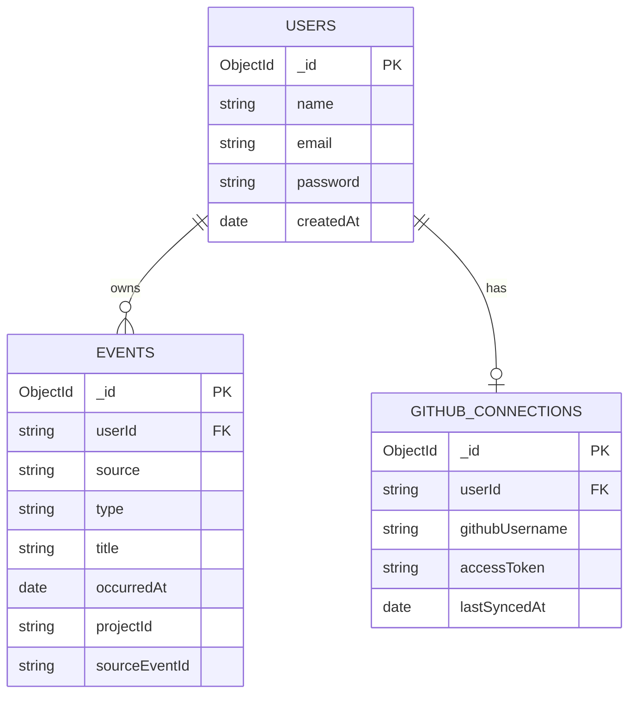
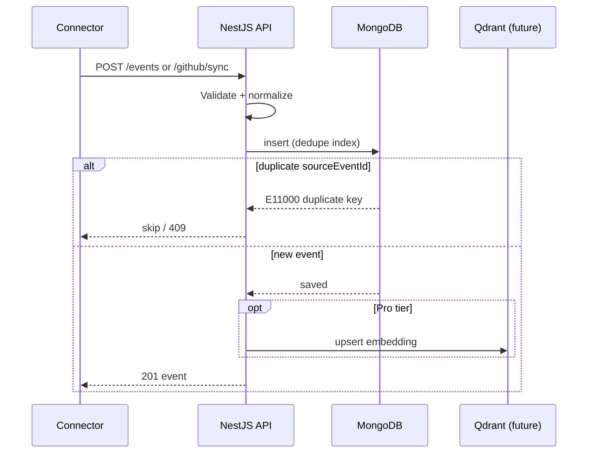

# AI Time Machine — Phase 3 Database Design

**Status:** v1.0  
**Date:** 2026-07-20  
**Depends on:** Phase 1 (product), Phase 2 (architecture)  
**Current implementation:** MongoDB Atlas (Mongoose)

---

## Table of Contents

1. [Overview](#1-overview)
2. [Storage Strategy](#2-storage-strategy)
3. [MongoDB — Current (v1)](#3-mongodb--current-v1)
4. [PostgreSQL — Planned (v2)](#4-postgresql--planned-v2)
5. [Redis — Caching & Rate Limits](#5-redis--caching--rate-limits)
6. [Neo4j — Knowledge Graph](#6-neo4j--knowledge-graph)
7. [Qdrant — Vector Search](#7-qdrant--vector-search)
8. [Object Storage (S3)](#8-object-storage-s3)
9. [Indexing Strategy](#9-indexing-strategy)
10. [Partitioning & Retention](#10-partitioning--retention)
11. [Backup & Recovery](#11-backup--recovery)
12. [Data Flow Diagrams](#12-data-flow-diagrams)
13. [Migration Path](#13-migration-path)

---

## 1. Overview

AI Time Machine stores three categories of data:

| Category | Examples | Store (v1) | Store (future) |
|---|---|---|---|
| **Identity** | users, sessions, connector tokens | MongoDB | PostgreSQL |
| **Events** | commits, PRs, messages, notes | MongoDB | MongoDB + time partitions |
| **Intelligence** | embeddings, graph edges, AI cache | — | Qdrant + Neo4j + Redis |

**Design principles:**

- All timestamps stored in **UTC** (`Date` / `timestamptz`).
- User-facing dates use **IANA timezone** at query time (not stored per event).
- Connector dedupe via `(userId, source, sourceEventId)`.
- Sensitive tokens encrypted at rest before production.

---

## 2. Storage Strategy

```text
                    ┌──────────────────────────────────────┐
                    │           Application Layer           │
                    └───────────────────┬──────────────────┘
                                        │
        ┌───────────────┬───────────────┼───────────────┬───────────────┐
        ▼               ▼               ▼               ▼               ▼
   ┌─────────┐    ┌──────────┐   ┌──────────┐   ┌──────────┐   ┌──────────┐
   │ MongoDB │    │PostgreSQL│   │  Redis   │   │  Qdrant  │   │  Neo4j   │
   │ (v1)    │    │ (v2)     │   │ (cache)  │   │ (vectors)│   │ (graph)  │
   └─────────┘    └──────────┘   └──────────┘   └──────────┘   └──────────┘
        │                                                    ┌──────────┐
        └────────────────────────────────────────────────────│   S3     │
                                                             │ (blobs)  │
                                                             └──────────┘
```

| Phase | What ships |
|---|---|
| **v1 (now)** | MongoDB only — users, events, github_connections |
| **v1.1** | Redis replay cache + rate limit counters |
| **v2** | PostgreSQL for billing/subscriptions; MongoDB events retained |
| **v2.1** | Qdrant embeddings for semantic search (Pro tier) |
| **v3** | Neo4j knowledge graph + S3 attachments |

---

## 3. MongoDB — Current (v1)

**Database:** Atlas cluster (connection via `MONGODB_URI`)  
**ODM:** Mongoose 9.x  
**Collections:** `users`, `events`, `githubconnections`

### 3.1 Collection: `users`

**Purpose:** Account identity for MVP (no JWT yet).

| Field | Type | Required | Index | Notes |
|---|---|---|---|---|
| `_id` | ObjectId | auto | PK | Returned to frontend as `userId` |
| `name` | String | no | — | Display name |
| `email` | String | no | unique (planned) | Login identifier |
| `password` | String | no | — | **Plaintext today — hash before prod** |
| `timezone` | String | no | — | **Planned:** IANA default e.g. `Asia/Kolkata` |
| `tier` | String | no | — | **Planned:** `free` \| `pro` \| `team` |
| `createdAt` | Date | auto | — | Mongoose timestamps |
| `updatedAt` | Date | auto | — | Mongoose timestamps |

**Current schema (code):**

```typescript
// src/UserModule/userEntity.ts
{ name: String, email: String, password: String }
```

**Planned indexes:**

```javascript
db.users.createIndex({ email: 1 }, { unique: true, sparse: true })
```

**Example document:**

```json
{
  "_id": "674a1b2c3d4e5f6789012345",
  "name": "Aakash Sharma",
  "email": "aakash@example.com",
  "password": "hashed_or_plain_mvp",
  "createdAt": "2026-07-20T08:00:00.000Z",
  "updatedAt": "2026-07-20T08:00:00.000Z"
}
```

---

### 3.2 Collection: `events`

**Purpose:** Normalized digital activity — core of timeline and replay.

| Field | Type | Required | Index | Notes |
|---|---|---|---|---|
| `_id` | ObjectId | auto | PK | |
| `userId` | String | yes | yes | Owner (MongoDB user `_id` as string) |
| `source` | String (enum) | yes | compound | `github`, `slack`, `manual`, … |
| `type` | String (enum) | yes | — | `commit`, `message`, `note`, … |
| `title` | String | yes | text (future) | Human-readable headline |
| `content` | String | no | text (future) | Body / description |
| `summary` | String | no | — | AI-generated later |
| `occurredAt` | Date | yes | yes | **When it happened (UTC)** |
| `projectId` | String | no | yes | e.g. GitHub `owner/repo` |
| `tags` | [String] | no | — | Connector labels |
| `sourceEventId` | String | no | unique compound | Dedupe key from source |
| `metadata` | Mixed | no | — | Raw connector payload |
| `createdAt` | Date | auto | — | Ingest time |
| `updatedAt` | Date | auto | — | Last update |

**Enums — `source`:**

```
gmail | slack | github | vscode | chrome | calendar | notion | drive | photos | manual
```

**Enums — `type`:**

```
email | message | commit | file_edit | browse | meeting | note | file | photo | other
```

**Indexes (implemented):**

```javascript
// Timeline queries — user's events by time
{ userId: 1, occurredAt: -1 }

// Dedupe — one event per source record per user
{ userId: 1, source: 1, sourceEventId: 1 }
  unique: true
  partialFilterExpression: { sourceEventId: { $type: "string" } }
```

**Example document (GitHub commit):**

```json
{
  "_id": "674a1b2c3d4e5f6789012346",
  "userId": "674a1b2c3d4e5f6789012345",
  "source": "github",
  "type": "commit",
  "title": "Push to agileinfoways/Backend-data (a1b2c3d)",
  "content": "feat: add timeline replay\nfix: timezone handling",
  "summary": "",
  "occurredAt": "2026-07-20T09:15:00.000Z",
  "projectId": "agileinfoways/Backend-data",
  "tags": ["PushEvent"],
  "sourceEventId": "github-12345678901",
  "metadata": {
    "githubEventType": "PushEvent",
    "repo": "agileinfoways/Backend-data",
    "payload": { "ref": "refs/heads/main", "commits": [] }
  },
  "createdAt": "2026-07-20T09:16:00.000Z",
  "updatedAt": "2026-07-20T09:16:00.000Z"
}
```

**Query patterns:**

| Use case | Query |
|---|---|
| Day replay | `{ userId, occurredAt: { $gte, $lte } }` sort `occurredAt: 1` |
| List events | `{ userId, ...filters }` sort `occurredAt: -1` limit 500 |
| Dedupe insert | unique index rejects duplicate `sourceEventId` |

---

### 3.3 Collection: `githubconnections`

**Purpose:** Store GitHub PAT and sync state per user.

| Field | Type | Required | Index | Notes |
|---|---|---|---|---|
| `_id` | ObjectId | auto | PK | |
| `userId` | String | yes | unique | One connection per user |
| `githubUsername` | String | yes | — | From GitHub API |
| `accessToken` | String | yes | — | **Encrypt before prod** |
| `lastSyncedAt` | Date | no | — | Last successful sync |
| `createdAt` | Date | auto | — | |
| `updatedAt` | Date | auto | — | |

**Example document:**

```json
{
  "_id": "674a1b2c3d4e5f6789012347",
  "userId": "674a1b2c3d4e5f6789012345",
  "githubUsername": "aakashsharma",
  "accessToken": "ghp_encrypted_token",
  "lastSyncedAt": "2026-07-20T10:00:00.000Z",
  "createdAt": "2026-07-20T09:00:00.000Z",
  "updatedAt": "2026-07-20T10:00:00.000Z"
}
```

**Security note:** Never log `accessToken`. Use AES-256-GCM with key from env `TOKEN_ENCRYPTION_KEY`.

---

### 3.4 Entity Relationship (MongoDB v1)



---

## 4. PostgreSQL — Planned (v2)

**Purpose:** Relational data requiring ACID, joins, and billing integrity.

### 4.1 Schema: `users` (mirror + enrich)

```sql
CREATE TABLE users (
  id            UUID PRIMARY KEY DEFAULT gen_random_uuid(),
  mongo_id      VARCHAR(24) UNIQUE NOT NULL,  -- bridge to MongoDB during migration
  email         VARCHAR(255) UNIQUE NOT NULL,
  name          VARCHAR(255) NOT NULL,
  password_hash VARCHAR(255) NOT NULL,
  timezone      VARCHAR(64) NOT NULL DEFAULT 'UTC',
  tier          VARCHAR(16) NOT NULL DEFAULT 'free'
                CHECK (tier IN ('free', 'pro', 'team', 'enterprise')),
  created_at    TIMESTAMPTZ NOT NULL DEFAULT NOW(),
  updated_at    TIMESTAMPTZ NOT NULL DEFAULT NOW()
);

CREATE INDEX idx_users_email ON users(email);
```

### 4.2 Schema: `subscriptions`

```sql
CREATE TABLE subscriptions (
  id                UUID PRIMARY KEY DEFAULT gen_random_uuid(),
  user_id           UUID NOT NULL REFERENCES users(id),
  stripe_customer_id VARCHAR(255),
  stripe_sub_id     VARCHAR(255),
  plan              VARCHAR(16) NOT NULL,  -- free | pro | team
  status            VARCHAR(16) NOT NULL,  -- active | canceled | past_due
  current_period_end TIMESTAMPTZ,
  created_at        TIMESTAMPTZ NOT NULL DEFAULT NOW()
);

CREATE INDEX idx_subscriptions_user ON subscriptions(user_id);
```

### 4.3 Schema: `connector_accounts`

```sql
CREATE TABLE connector_accounts (
  id            UUID PRIMARY KEY DEFAULT gen_random_uuid(),
  user_id       UUID NOT NULL REFERENCES users(id),
  provider      VARCHAR(32) NOT NULL,  -- github | gmail | slack
  external_id   VARCHAR(255),          -- github user id
  token_enc     BYTEA NOT NULL,        -- encrypted OAuth/PAT
  scopes        TEXT[],
  last_synced_at TIMESTAMPTZ,
  created_at    TIMESTAMPTZ NOT NULL DEFAULT NOW(),
  UNIQUE (user_id, provider)
);
```

### 4.4 Schema: `audit_logs` (Enterprise)

```sql
CREATE TABLE audit_logs (
  id         BIGSERIAL PRIMARY KEY,
  user_id    UUID,
  action     VARCHAR(64) NOT NULL,
  resource   VARCHAR(128),
  metadata   JSONB,
  ip         INET,
  created_at TIMESTAMPTZ NOT NULL DEFAULT NOW()
);

CREATE INDEX idx_audit_user_time ON audit_logs(user_id, created_at DESC);
```

**Why not move events to PostgreSQL?**  
Events are append-heavy, document-shaped, and benefit from MongoDB's flexible `metadata`. PostgreSQL holds identity, billing, and audit.

---

## 5. Redis — Caching & Rate Limits

### 5.1 Key patterns

| Key pattern | TTL | Purpose |
|---|---|---|
| `replay:{userId}:{date}:{tz}:{projectId?}` | 60s | Cached timeline replay JSON |
| `events:list:{userId}:{hash}` | 30s | Cached event list |
| `ratelimit:{ip}:{endpoint}` | 60s | Rate limit counter |
| `github:sync:lock:{userId}` | 120s | Prevent concurrent syncs |
| `session:{jwtId}` | 7d | JWT session (future) |

### 5.2 Replay cache example

```
Key:   replay:674a1b2c:2026-07-20:Asia/Kolkata
Value: <JSON TimelineReplayResponse>
TTL:   60 seconds

Invalidate on:
  - POST /events (same userId + same local day)
  - POST /connectors/github/sync (same userId)
```

### 5.3 Rate limits (planned)

| Tier | Limit |
|---|---|
| Free | 100 req/min per IP |
| Pro | 500 req/min |
| Team | 2000 req/min |

---

## 6. Neo4j — Knowledge Graph

**Purpose (Pro+):** Connect entities across events — repos, people, PRs, issues, topics.

### 6.1 Node labels

| Label | Properties | Source |
|---|---|---|
| `User` | `userId`, `name` | users collection |
| `Repository` | `fullName`, `url` | GitHub events |
| `Commit` | `sha`, `message` | PushEvent |
| `PullRequest` | `number`, `title`, `state` | PullRequestEvent |
| `Issue` | `number`, `title` | IssuesEvent |
| `Project` | `projectId`, `name` | projectId field |
| `Topic` | `name` | AI extraction (future) |

### 6.2 Relationship types

```cypher
(User)-[:OWNS]->(Repository)
(User)-[:AUTHORED]->(Commit)
(Commit)-[:IN_REPO]->(Repository)
(PullRequest)-[:IN_REPO]->(Repository)
(Issue)-[:IN_REPO]->(Repository)
(Event)-[:RELATES_TO]->(Topic)
(Commit)-[:REFERENCES]->(Issue)
```

### 6.3 Example query — "What did I work on in repo X?"

```cypher
MATCH (u:User {userId: $userId})-[:AUTHORED]->(c:Commit)-[:IN_REPO]->(r:Repository {fullName: $repo})
WHERE c.timestamp >= $from AND c.timestamp <= $to
RETURN c ORDER BY c.timestamp
```

---

## 7. Qdrant — Vector Search

**Purpose (Pro+):** Semantic search over event text.

### 7.1 Collection: `event_embeddings`

| Setting | Value |
|---|---|
| Collection name | `event_embeddings` |
| Vector size | 1536 (OpenAI text-embedding-3-small) |
| Distance | Cosine |
| Payload fields | `userId`, `eventId`, `source`, `type`, `occurredAt`, `projectId`, `title` |

### 7.2 Point structure

```json
{
  "id": "674a1b2c3d4e5f6789012346",
  "vector": [0.012, -0.034, ...],
  "payload": {
    "userId": "674a1b2c3d4e5f6789012345",
    "eventId": "674a1b2c3d4e5f6789012346",
    "source": "github",
    "type": "commit",
    "occurredAt": "2026-07-20T09:15:00.000Z",
    "projectId": "agileinfoways/Backend-data",
    "title": "Push to agileinfoways/Backend-data"
  }
}
```

### 7.3 Search flow

```text
User query → embed → Qdrant search (filter: userId) → top-k eventIds
  → MongoDB fetch full events → RAG context → LLM answer
```

### 7.4 Indexing filter

Always filter by `userId` in Qdrant payload to enforce tenant isolation.

---

## 8. Object Storage (S3)

**Purpose:** Large blobs not suited for MongoDB.

| Bucket path | Content |
|---|---|
| `exports/{userId}/{date}.json` | Memory export (Pro) |
| `attachments/{eventId}/{filename}` | Screenshots, files |
| `backups/mongo/{date}/` | Automated backups |

**Lifecycle rules:**

- Free tier exports: delete after 7 days
- Pro exports: retain 90 days
- Attachments: user-controlled deletion

---

## 9. Indexing Strategy

### 9.1 MongoDB (current)

| Collection | Index | Query served |
|---|---|---|
| `events` | `{ userId: 1, occurredAt: -1 }` | List + replay |
| `events` | `{ userId: 1, source: 1, sourceEventId: 1 }` unique partial | Dedupe |
| `events` | `{ userId: 1, projectId: 1, occurredAt: -1 }` | Project replay (planned) |
| `events` | `{ userId: 1, source: 1, occurredAt: -1 }` | Filter by source |
| `users` | `{ email: 1 }` unique | Login (planned) |
| `githubconnections` | `{ userId: 1 }` unique | One connector per user |

### 9.2 Text search (planned)

```javascript
db.events.createIndex(
  { title: "text", content: "text", summary: "text" },
  { weights: { title: 10, summary: 5, content: 1 }, name: "event_text" }
)
```

### 9.3 Qdrant HNSW params (planned)

```
m: 16
ef_construct: 100
ef_search: 64
```

---

## 10. Partitioning & Retention

### 10.1 Free tier — 30 days history

**Enforcement (planned):**

```javascript
// On list/replay queries for free users
const cutoff = new Date();
cutoff.setDate(cutoff.getDate() - 30);
filter.occurredAt = { $gte: cutoff, ...existing };
```

**UI:** Show upgrade prompt when user selects date older than 30 days.

### 10.2 Time-based partitioning (scale)

When events exceed ~10M per cluster:

```text
events_2026_07   (July 2026)
events_2026_08   (August 2026)
...
```

Or MongoDB Atlas **time series collections**:

```javascript
db.createCollection("events_ts", {
  timeseries: { timeField: "occurredAt", metaField: "userId", granularity: "hours" }
})
```

### 10.3 Retention by tier

| Tier | History | Export | Attachments |
|---|---|---|---|
| Free | 30 days | — | — |
| Pro | Unlimited | 90 days | 10 GB |
| Team | Unlimited | 1 year | 50 GB/user |
| Enterprise | Custom | Custom | Custom |

### 10.4 GDPR / deletion

```javascript
// Delete all user data
db.events.deleteMany({ userId })
db.githubconnections.deleteMany({ userId })
db.users.deleteOne({ _id: ObjectId(userId) })
// + Qdrant delete by userId filter
// + S3 delete prefix exports/{userId}/
```

---

## 11. Backup & Recovery

### 11.1 MongoDB Atlas (current)

| Setting | Value |
|---|---|
| Provider | MongoDB Atlas |
| Backup | Atlas continuous backup (enable on cluster) |
| Snapshot frequency | Every 6 hours (Atlas default) |
| Point-in-time recovery | Enable for production |
| Retention | 7 days (dev) / 30 days (prod) |

### 11.2 Manual export script (planned)

```bash
mongodump --uri="$MONGODB_URI" --out=./backups/$(date +%Y%m%d)
```

### 11.3 Disaster recovery RTO/RPO

| Metric | Target |
|---|---|
| RPO (max data loss) | 1 hour |
| RTO (max downtime) | 4 hours |
| Failover | Atlas multi-region replica set (prod) |

### 11.4 Redis / Qdrant / Neo4j backups

- Redis: RDB snapshots every 15 min + AOF
- Qdrant: snapshot API to S3 daily
- Neo4j: `neo4j-admin backup` to S3 daily

---

## 12. Data Flow Diagrams

### 12.1 Event ingest → storage



### 12.2 Replay read path

```mermaid
sequenceDiagram
    participant F as Frontend
    participant API as NestJS API
    participant R as Redis (future)
    participant M as MongoDB

    F->>API: GET /timeline/replay?date&timezone
    API->>API: localDayBoundsUtc(date, tz)
    opt cache hit
        API->>R: GET replay:key
        R-->>API: cached JSON
    else cache miss
        API->>M: find events in UTC range
        M-->>API: events[]
        API->>API: group by local hour
        API->>R: SET replay:key TTL 60s
    end
    API-->>F: TimelineReplayResponse
```

---

## 13. Migration Path

| Step | Action |
|---|---|
| 1 | Add `email` unique index on `users` |
| 2 | Hash passwords (bcrypt) before prod |
| 3 | Encrypt `accessToken` in `githubconnections` |
| 4 | Add `timezone`, `tier` to user schema |
| 5 | Enforce 30-day retention for free tier |
| 6 | Introduce Redis replay cache |
| 7 | PostgreSQL for billing/subscriptions |
| 8 | Qdrant for Pro semantic search |
| 9 | Neo4j for knowledge graph |
| 10 | Time-series partitioning at scale |

---

## Appendix A — Collection size estimates

| Users | Events/user/month | Total events (1yr) | MongoDB size (est.) |
|---|---|---|---|
| 1,000 | 500 | 6M | ~3 GB |
| 10,000 | 500 | 60M | ~30 GB |
| 100,000 | 500 | 600M | ~300 GB → partition |

Assumption: ~500 bytes average per event document.
