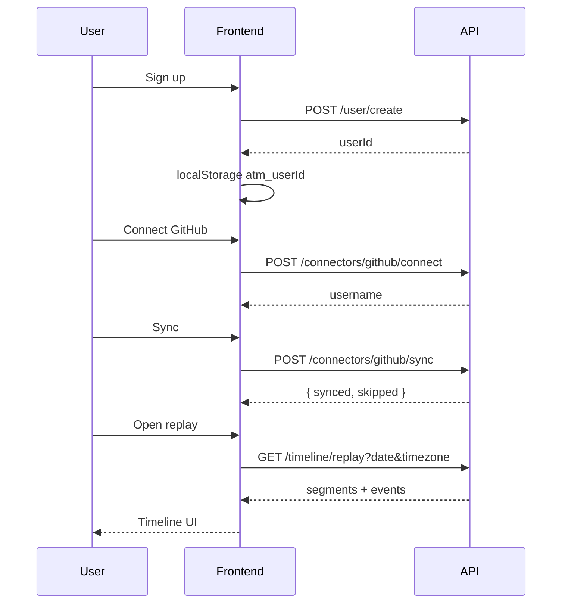

# Phase 3 — Frontend Integration (Data Models & Full API Surface)

**Backend phase:** Database design locked; all v1 endpoints stable  
**Status:** Implemented  
**Depends on:** Phase 1 (signup), Phase 2 (timeline + GitHub)

This doc is the **complete frontend reference** for data shapes, storage rules, and every API call.

---

## 1. What Phase 3 adds for frontend

- Full understanding of **what data looks like** in API responses
- How **collections map** to UI entities
- **Retention rules** (30-day free tier — UI implications)
- **Complete TypeScript types** for all entities
- **Unified API client** covering every endpoint
- **Screen inventory** for the full v1 app

---

## 2. Environment

```env
VITE_API_URL=http://localhost:3000
```

Backend `CORS_ORIGINS` must include your frontend origin (`http://localhost:5173`).

---

## 3. Data models (what the UI displays)

### 3.1 User

```ts
export interface User {
  _id: string;           // use as userId everywhere
  name: string;
  email: string;
  password: string;        // returned today — never store in localStorage
  createdAt?: string;
  updatedAt?: string;
}
```

**Frontend storage:** save only `_id` and `name`.

```ts
localStorage.setItem('atm_userId', user._id);
localStorage.setItem('atm_userName', user.name);
```

---

### 3.2 Event (core UI entity)

```ts
export type EventSource =
  | 'gmail' | 'slack' | 'github' | 'vscode' | 'chrome'
  | 'calendar' | 'notion' | 'drive' | 'photos' | 'manual';

export type EventType =
  | 'email' | 'message' | 'commit' | 'file_edit' | 'browse'
  | 'meeting' | 'note' | 'file' | 'photo' | 'other';

export interface Event {
  _id: string;
  userId: string;
  source: EventSource;
  type: EventType;
  title: string;
  content: string;
  summary: string;
  occurredAt: string;       // UTC ISO — convert for display
  projectId: string | null; // e.g. "owner/repo" for GitHub
  tags: string[];
  sourceEventId: string | null;
  metadata: Record<string, unknown>;
  createdAt: string;
  updatedAt: string;
}
```

**Display helpers:**

```ts
export function formatEventTime(iso: string, tz?: string): string {
  return new Date(iso).toLocaleString(undefined, {
    timeZone: tz ?? Intl.DateTimeFormat().resolvedOptions().timeZone,
    hour: '2-digit',
    minute: '2-digit',
  });
}

export function sourceIcon(source: EventSource): string {
  const icons: Record<EventSource, string> = {
    github: '🐙', slack: '💬', gmail: '📧', vscode: '💻',
    chrome: '🌐', calendar: '📅', notion: '📝', drive: '📁',
    photos: '📷', manual: '✏️',
  };
  return icons[source] ?? '•';
}
```

---

### 3.3 Timeline replay

```ts
export interface TimelineSegment {
  hour: number;    // 0–23 local
  label: string;   // "09:00"
  events: Event[];
}

export interface TimelineReplay {
  userId: string;
  date: string;              // YYYY-MM-DD
  timezone: string;          // IANA echo from request
  totalEvents: number;
  sources: Record<string, number>;  // { github: 10, manual: 2 }
  types: Record<string, number>;    // { commit: 8, note: 2 }
  segments: TimelineSegment[];
  events: Event[];
}
```

**UI mapping:**

| Response field | UI component |
|---|---|
| `segments` | Hourly timeline columns |
| `sources` | Filter chips / stats bar |
| `types` | Secondary stats |
| `events` | Flat list view (alternative to segments) |
| `totalEvents` | Header count |

---

### 3.4 GitHub connection

```ts
export interface GitHubStatus {
  connected: boolean;
  username?: string;
  lastSyncedAt?: string | null;
}

export interface GitHubSyncResult {
  synced: number;
  skipped: number;
}
```

---

## 4. Time rules (critical)

| Action | Rule |
|---|---|
| Store in DB | UTC (`occurredAt`) |
| Date picker value | Local `YYYY-MM-DD` |
| API `timezone` param | IANA from browser |
| Display times | `toLocaleString` with user TZ |
| Segment labels | Already local (`"09:00"`) — use as-is |

```ts
// src/lib/timezone.ts
export function getUserTimezone(): string {
  return Intl.DateTimeFormat().resolvedOptions().timeZone;
}

export function getTodayLocal(): string {
  return new Date().toLocaleDateString('en-CA', {
    timeZone: getUserTimezone(),
  });
}
```

---

## 5. Retention (free tier — UI)

Per Phase 1 pricing: **Free = 30 days history**.

Backend enforcement is planned. Frontend should:

1. Disable date picker dates older than 30 days for free users
2. Show upgrade CTA when user picks blocked date
3. Display banner: "Showing last 30 days on Free plan"

```ts
export function getFreeTierCutoffDate(): string {
  const d = new Date();
  d.setDate(d.getDate() - 30);
  return d.toLocaleDateString('en-CA');
}

export function isDateWithinFreeTier(date: string): boolean {
  return date >= getFreeTierCutoffDate();
}
```

---

## 6. Complete API client

```ts
// src/lib/api.ts
const API_URL = import.meta.env.VITE_API_URL ?? 'http://localhost:3000';

function getTimezone() {
  return Intl.DateTimeFormat().resolvedOptions().timeZone;
}

function qs(params: Record<string, string | undefined>) {
  const q = new URLSearchParams();
  for (const [k, v] of Object.entries(params)) {
    if (v != null && v !== '') q.set(k, v);
  }
  return q.toString();
}

async function request<T>(path: string, options?: RequestInit): Promise<T> {
  const res = await fetch(`${API_URL}${path}`, {
    headers: { 'Content-Type': 'application/json', ...options?.headers },
    ...options,
  });
  const body = await res.json().catch(() => ({}));
  if (!res.ok) {
    const msg = Array.isArray(body.message)
      ? body.message.join(', ')
      : body.message ?? `HTTP ${res.status}`;
    throw new Error(msg);
  }
  return body;
}

export const api = {
  // Health
  health: () => request<{ message: string }>('/hello'),

  // Users
  createUser: (data: { name: string; email: string; password: string }) =>
    request<User>('/user/create', { method: 'POST', body: JSON.stringify(data) }),

  // Events
  createEvent: (data: CreateEventPayload) =>
    request<Event>('/events', { method: 'POST', body: JSON.stringify(data) }),

  createEventsBatch: (events: CreateEventPayload[]) =>
    request<Event[]>('/events/batch', {
      method: 'POST',
      body: JSON.stringify({ events }),
    }),

  listEvents: (params: {
    userId: string;
    from?: string;
    to?: string;
    source?: EventSource;
    projectId?: string;
  }) => request<Event[]>(`/events?${qs(params)}`),

  // Timeline
  replayDay: (userId: string, date: string, projectId?: string) =>
    request<TimelineReplay>(
      `/timeline/replay?${qs({ userId, date, timezone: getTimezone(), projectId })}`,
    ),

  getTimelineDay: (userId: string, date: string) =>
    request<{ userId: string; date: string; timezone: string; totalEvents: number; events: Event[] }>(
      `/timeline/day?${qs({ userId, date, timezone: getTimezone() })}`,
    ),

  getTimelineRange: (userId: string, from: string, to: string) =>
    request<{ userId: string; from: string; to: string; totalEvents: number; events: Event[] }>(
      `/timeline/range?${qs({ userId, from, to })}`,
    ),

  // GitHub
  connectGitHub: (userId: string, accessToken: string) =>
    request<{ connected: true; username: string }>('/connectors/github/connect', {
      method: 'POST',
      body: JSON.stringify({ userId, accessToken }),
    }),

  syncGitHub: (userId: string) =>
    request<GitHubSyncResult>('/connectors/github/sync', {
      method: 'POST',
      body: JSON.stringify({ userId }),
    }),

  getGitHubStatus: (userId: string) =>
    request<GitHubStatus>(`/connectors/github/status?userId=${userId}`),
};
```

---

## 7. Full app screen map

| Screen | Route | APIs | Key data |
|---|---|---|---|
| Landing | `/` | — | Marketing |
| Signup | `/app/signup` | `POST /user/create` | User |
| Login | `/app/login` | (future JWT) | — |
| Dashboard | `/app` | `GET /connectors/github/status` | GitHub status |
| **Replay** | `/app/replay` | `GET /timeline/replay` | TimelineReplay |
| Event explorer | `/app/events` | `GET /events` | Event[] |
| GitHub settings | `/app/settings/github` | connect, sync, status | GitHubStatus |
| Manual note | `/app/note/new` | `POST /events` | Event |
| Project view | `/app/project/:id` | replay with `projectId` | TimelineReplay |

---

## 8. Replay page (complete example)

```tsx
// src/pages/ReplayPage.tsx
import { useCallback, useEffect, useState } from 'react';
import { api } from '@/lib/api';
import { getTodayLocal, getUserTimezone, isDateWithinFreeTier } from '@/lib/timezone';
import { requireUserId } from '@/lib/session';
import type { TimelineReplay } from '@/types';

export function ReplayPage() {
  const [date, setDate] = useState(getTodayLocal());
  const [replay, setReplay] = useState<TimelineReplay | null>(null);
  const [loading, setLoading] = useState(true);
  const [error, setError] = useState<string | null>(null);

  const load = useCallback(async () => {
    if (!isDateWithinFreeTier(date)) {
      setError('Free plan: replay limited to last 30 days. Upgrade to Pro.');
      setReplay(null);
      return;
    }
    setLoading(true);
    setError(null);
    try {
      const data = await api.replayDay(requireUserId(), date);
      setReplay(data);
    } catch (e) {
      setError(e instanceof Error ? e.message : 'Failed to load replay');
    } finally {
      setLoading(false);
    }
  }, [date]);

  useEffect(() => { load(); }, [load]);

  return (
    <div>
      <header>
        <h1>Replay — {date}</h1>
        <input
          type="date"
          value={date}
          min={/* free tier cutoff */ undefined}
          max={getTodayLocal()}
          onChange={(e) => setDate(e.target.value)}
        />
        <span>{getUserTimezone()}</span>
      </header>

      {loading && <p>Loading…</p>}
      {error && <p role="alert">{error}</p>}

      {replay && (
        <>
          <p>{replay.totalEvents} events</p>
          <div className="stats">
            {Object.entries(replay.sources).map(([src, n]) => (
              <span key={src}>{src}: {n}</span>
            ))}
          </div>
          {replay.segments.map((seg) => (
            <section key={seg.hour}>
              <h2>{seg.label}</h2>
              <ul>
                {seg.events.map((ev) => (
                  <li key={ev._id}>
                    <strong>{ev.title}</strong>
                    <small> · {ev.source} / {ev.type}</small>
                    {ev.projectId && <small> · {ev.projectId}</small>}
                  </li>
                ))}
              </ul>
            </section>
          ))}
        </>
      )}
    </div>
  );
}
```

---

## 9. Onboarding flow (signup → GitHub → replay)



---

## 10. Error handling matrix

| Error | Cause | UI action |
|---|---|---|
| `Failed to fetch` | Backend down / wrong port | Check `VITE_API_URL`, start backend |
| CORS error | Origin not in `CORS_ORIGINS` | Add `localhost:5173` to backend env |
| `400` validation | Bad timezone, missing fields | Show `message` from API |
| `404` GitHub | Not connected | Redirect to GitHub settings |
| Empty replay | No events for date | "No activity" + suggest sync |

---

## 11. Phase 3 checklist

- [ ] Copy all TypeScript types to `src/types/`
- [ ] Use unified `api.ts` client
- [ ] Send `timezone` on all `/timeline/day` and `/timeline/replay` calls
- [ ] Date picker: local `YYYY-MM-DD`, max = today
- [ ] Free tier: block dates > 30 days ago
- [ ] Display `occurredAt` in local time, not UTC
- [ ] GitHub onboarding: connect → sync → replay
- [ ] Show `sources` / `types` stats on replay header
- [ ] Optional: project filter via `projectId` query param

**Reference docs:**
- Full API spec: `docs/api/phase-4-api-documentation.md`
- Database shapes: `docs/database/phase-3-database-design.md`

**Next:** `phase-4-frontend-integration.md` when AI/search endpoints ship (Phase 5).
